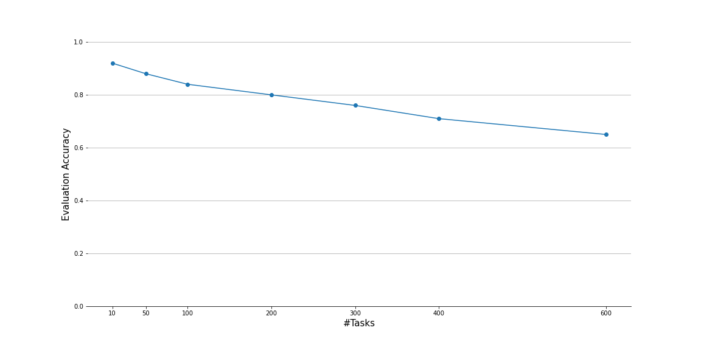

PyTorch implementation of the "ANML" algorithm ([paper](https://arxiv.org/abs/2002.09571) [code](https://github.com/uvm-neurobotics-lab/ANML)) using the [higher](https://github.com/facebookresearch/higher) framework


# Overview

The "training" of a few-shots meta-learned model like ANML consists of:
- train-train: the model is shown a random (initially new) task, i.e. 20 chars from one Omniglot class (a.k.a. learning phase)
- train-test: the model is tested on the last task it has just trained on and a sample of 64 random images from all the classes (a.k.a. remembering phase)
- test-train: at test time the model is shown a few examples (15) of a new class not seen during train-train. Labels are also provided and the model is asked to quickly learn this new class without forgetting (for 600 the learning sequence is 9000 gradient updates long)
- test-test: after learning from the few-shots the model performance is evaluated on the holdout examples.

The code for these phases can be found inside [this](anml.py) file.

# Prerequisites

- Python3 
- PyTorch 1.6.0 
- [higher](https://github.com/facebookresearch/higher)
- numpy
- tqdm

# Training

Phase       | Trained    |  Optimizer  | LR
 ---------- | ---------  | ----------  | -----
 inner loop | rln + fc   | SGD         | 0.1
 outer loop | everything | Adam        | 0.003

Training can be performed using

```
python train_omni.py
``` 
flags can be provided for exploring different setups.

# Evaluation


Number of tasks | Accuracy | Eval LR
----| ---- | ------- 
10  | 0.90 | 0.0010 
50  | 0.89 | 0.0010
75  | 0.86 | 0.0010 
100 | 0.85 | 0.0010 
200 | 0.80 | 0.0008 
300 | 0.76 | 0.0008 
400 | 0.72 | 0.0008 
600 | 0.65 | 0.0008

Evaluation can be performed using

```bash
python eval_omni.py --model trained_anmls/256_112_2304_ANML-29999.pth --classes 10 --lr 0.00085 --runs 10
```

During evaluation the model is quite sensitive to learning rates used, the data shown in the above table has been gathered sweeping several learning rates over multiple repeats.
